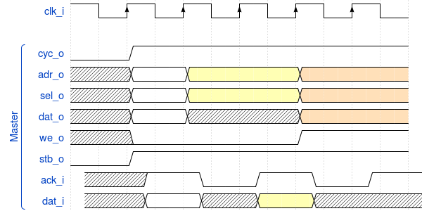
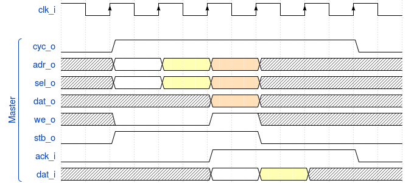

% title: Selected Lessons Learned
% title: Building the KCP53000
% author: Samuel A. Falvo II &lt;kc5tja@arrl.net>
% thankyou: Thanks everyone!
% contact: Email <a href="mailto:kc5tja@arrl.net">Samuel A. Falvo II &lt;kc5tja@arrl.net></a>
% contact: Web <a href="https://kestrelcomputer.github.io/kestrel">https://kestrelcomputer.github.io/kestrel</a>
% contact: Github <a href="http://github.com/kestrelcomputer">https://github.com/kestrelcomputer</a>

---
title: I do not have a name,  I have a number!
subtitle: <i>I am a free core!</i>
class: segue dark nobackground

---
title: Use numbers, not names.
subtitle: They're harder for companies to trademark.

- KCP53000 went through several names during its development.
    - Original name long forgotten.
    - Polaris (trademarked by AMD for a line of GPUs)
    - Now, KCP53000.
- We *want* what Intel, AMD, et. al. *doesn't* want.
- Be proactive in avoiding legal issues.

---
title: Avoid Premature Pipelining
subtitle: Get it working first.
class: segue dark nobackground

---
title: Avoid Pipelining At First.
subtitle: Build slow, sequenced, working implementation first.

- First 4 attempts at building pipelined CPU failed.
- Hockey-stick complexity; can't keep it all in your head at once.
- Premature evil is the root of all optimization.

---
title: Avoid Pipelining At First.
subtitle: Build slow, sequenced, working implementation first.

- 5th attempt was successful.
    - Two stage pipeline.
    - PLA-based sequencer just like the 6502.
    - Instruction fetch and instruction execution *currently* take turns.
    - Easy to alter PLA terms to allow *simultaneous* operation later.

---
title: Pipeline Design Documents Are Misleading
subtitle: They're not wrong; but, they're not right either.

Data is shown going from stage to stage to stage, sequentially.

---
title: Pipeline Design Documents Are Misleading
subtitle: They're not wrong; but, they're not right either.

Pipeline stages *really* are independent units cooperating under centralized control.

---
title: Pipeline Design Documents Are Misleading
subtitle: They're not wrong; but, they're not right either.

- Much easier to refactor later on.

Current KCP53000 pipeline structure:

---
title: Pipeline Design Documents Are Misleading
subtitle: They're not wrong; but, they're not right either.

- Opportunities for optimization:
    - Overlap instruction fetch with everything else (60%-100%)
    - Perform both register fetches at once (25%-33%)
    - Mirror BRAMs to emulate 2R1W register file (30%-50%)
- These compound.
    - Given same 25MHz clock, what once ran at 6 MIPS now runs between 16 and 24 MIPS

---
title: Count Furcula
subtitle: 64 bits! Ah! Ah! Ah!
class: segue dark nobackground

---
title: Furcula Bus
subtitle: Fork of Wishbone B3 to Meet CPU's Needs

- Justified data transfers: **no byte lanes**.
- Full address bus exposed: no elision for lower address bits.
- `SIZ_O(n:0)` exposed to indicate size of current transfer.
- `SIGNED_O` exposed to let external circuitry handle sign-extension.
- Otherwise, identical to Wishbone B3.

In retrospect, `SIGNED_O` is a mistake, but only a small one!

---
title: Wishbone vs. Furcula Bus
subtitle: Intel-style vs. Motorola-style Bus

How **Wishbone** Byte Lanes Work

<table width="100%">
 <tr>
  <th>&nbsp;</th>
  <th>Byte 0</th>
  <th>Byte 1</th>
  <th>Byte 2</th>
  <th>Byte 3</th>
  <th>HWord 0</th>
  <th>HWord 1</th>
  <th>Word</th>
 </tr>
 <tr>
  <td>DAT_IO[7:0]</td>
  <td>X</td>
  <td>&nbsp;</td>
  <td>&nbsp;</td>
  <td>&nbsp;</td>
  <td>X</td>
  <td>&nbsp;</td>
  <td>X</td>
 </tr>
 <tr>
  <td>DAT_IO[15:8]</td>
  <td>&nbsp;</td>
  <td>X</td>
  <td>&nbsp;</td>
  <td>&nbsp;</td>
  <td>X</td>
  <td>&nbsp;</td>
  <td>X</td>
 </tr>
 <tr>
  <td>DAT_IO[23:16]</td>
  <td>&nbsp;</td>
  <td>&nbsp;</td>
  <td>X</td>
  <td>&nbsp;</td>
  <td>&nbsp;</td>
  <td>X</td>
  <td>X</td>
 </tr>
 <tr>
  <td>DAT_IO[31:24]</td>
  <td>&nbsp;</td>
  <td>&nbsp;</td>
  <td>&nbsp;</td>
  <td>X</td>
  <td>&nbsp;</td>
  <td>X</td>
  <td>X</td>
 </tr>
</table>

---
title: Wishbone vs. Furcula Bus
subtitle: Intel-style vs. Motorola-style Bus

How **Furcula** Justification Works

<table width="100%">
 <tr>
  <th>&nbsp;</th>
  <th>Byte 0</th>
  <th>Byte 1</th>
  <th>Byte 2</th>
  <th>Byte 3</th>
  <th>HWord 0</th>
  <th>HWord 1</th>
  <th>Word</th>
 </tr>
 <tr>
  <td>DAT_IO[7:0]</td>
  <td>X</td>
  <td>X</td>
  <td>X</td>
  <td>X</td>
  <td>X</td>
  <td>X</td>
  <td>X</td>
 </tr>
 <tr>
  <td>DAT_IO[15:8]</td>
  <td>&nbsp;</td>
  <td>&nbsp;</td>
  <td>&nbsp;</td>
  <td>&nbsp;</td>
  <td>X</td>
  <td>X</td>
  <td>X</td>
 </tr>
 <tr>
  <td>DAT_IO[23:16]</td>
  <td>&nbsp;</td>
  <td>&nbsp;</td>
  <td>&nbsp;</td>
  <td>&nbsp;</td>
  <td>&nbsp;</td>
  <td>&nbsp;</td>
  <td>X</td>
 </tr>
 <tr>
  <td>DAT_IO[31:24]</td>
  <td>&nbsp;</td>
  <td>&nbsp;</td>
  <td>&nbsp;</td>
  <td>&nbsp;</td>
  <td>&nbsp;</td>
  <td>&nbsp;</td>
  <td>X</td>
 </tr>
</table>

---
title: Furcula Bus
subtitle: But, ..., <i>why?!</i>

- Allows *direct* CPU-to-external-circuitry connection.

- Intel CPUs pre-decode size and lower address bits to break data into individual byte lanes.
- Buses out-live CPUs.
- Supporting legacy buses requires *resynthesizing* information from byte lane enables.
- Thus, bus bridge circuitry must "undo" what CPU-internal circuitry already did.

---
title: Furcula Bus
subtitle: But, ..., <i>why?!</i>

- *Therefore,* just let external circuitry handle alignment and sign-extension exactly ONCE.

- Trivial to bridge to Wishbone B3.
    - Just needs some data bus multiplexors to route data to/from byte lanes.
    - Handful of gates to decode byte lane select signals.
    - Sign-extension logic.

---
title: Shoulda, Woulda, Coulda.
subtitle: I should have chosen Wishbone B4 over Wishbone B3.
class: segue dark nobackground

---
title: Wishbone B3
subtitle: Open Hardware's First Standard SoC Interconnect

Closer in scope to PCI bus than something like AXI4.

---
title: Wishbone B3
subtitle: Open Hardware's First Standard SoC Interconnect

- `ACK` must be asserted in same cycle (<= 35ns for 25MHz operation) to achieve *single-cycle* transfers.

---
title: Wishbone B3
subtitle: Open Hardware's First Standard SoC Interconnect

- `ACK` must be negated after transaction if accessing same slave back to back.  (50% efficient)

---
title: Wishbone B3
subtitle: Open Hardware's First Standard SoC Interconnect

To get 100% efficiency on bus, you *must*:

- Use fully asynchronous slave logic that responds in 35ns or less (assuming 25MHz bus).
- Ensure at least one address bit changes between cycles, so slave can detect end of one cycle and start of another.
- Alternatively, declare adjacent transactions to the same address undefined, and let software do the right thing.

---
title: Wishbone B3
subtitle: Why It Fails for Kestrel-3

- Bus bridges and adapters add propegation delays to address decoding logic.
- Brings max. clock speed from around 100MHz to 30MHz.  Ouch!
- Demonstrably incompatible with PSRAM chip timings on Nexys-2 board.

Kestrel-3 takes around 33ns from address valid to `ACK_I`.  (Remember, 35ns was our limit!)

---
title: Wishbone B3
subtitle: Why It Fails for Kestrel-3

- Improving performance requires introducing multiple clock domains, one for CPU, and one for Wishbone bus.
- Requires FIFOs and hard to debug async interlocks to work successfully.
- Works comfortably at somewhere below 20MHz clock speeds for something the size of Kestrel-3.
- For anything faster, you start to want something that works more closely *and more locally* with FPGA resources.

---
title: Wishbone B4 Pipelined
subtitle: or: How I Learned to Stop Worrying and Love the Clock

---
title: Wishbone B4 Pipelined
subtitle: or: How I Learned to Stop Worrying and Love the Clock

Observe:

- `CYC` asserted *as long as at least one cycle remains unterminated.*  No longer a bus request *as such*.
- `STB` now is the prime determinant in whether or not a bus cycle is valid or not.
- `ACK` no longer scoped by `STB`.  It may arrive at any time after a corresponding `STB`.
- `STALL` (not shown) used to throttle master if required.

---
title: Wishbone B4 Pipelined
subtitle: or: How I Learned to Stop Worrying and Love the Clock

Address decode latency *not* cured by increasing clock or introducing pipelining.  So why bother?

- Wishbone 3 works great at lower speeds because you have lots of time to generate `ACK` from address and `STB`.
- As clock period approaches propegation delay between LUTs, glitches increasingly manifest.
- DFFs work like synchronizers.  Every LUT has a corresponding DFF; adding them costs nothing.

---
title: Wishbone B4 Pipelined
subtitle: or: How I Learned to Stop Worrying and Love the Clock

Address decode latency *not* cured by increasing clock or introducing pipelining.  So why bother?

- Pipelining supports overlapping bus transactions without altering address decode latency.
- **Easier to synchronize across different clock domains.**
- **Easier to bridge across different protocols.**  (Wishbone to RapidIO, for example.)

---
title: Acknowledgements

I used <a href="https://github.com/rmcgibbo/slidedeck">Slidedeck</a> to prepare this slide deck.

I used <a href="https://wavedrom.com">Wavedrom</a> to prepare the timing diagrams.

